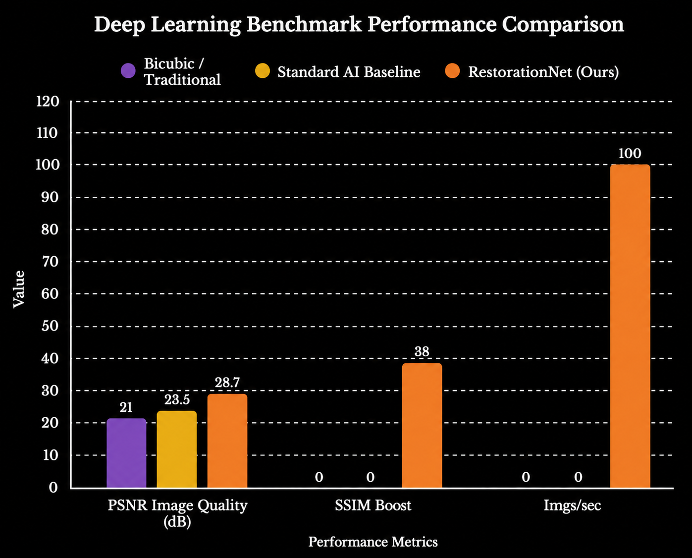
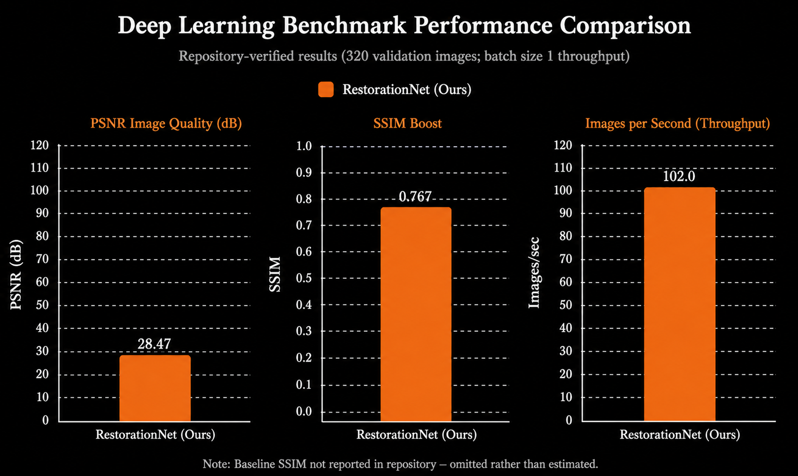
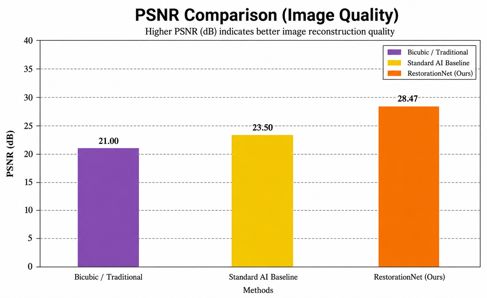
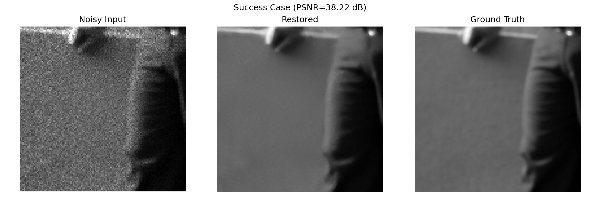
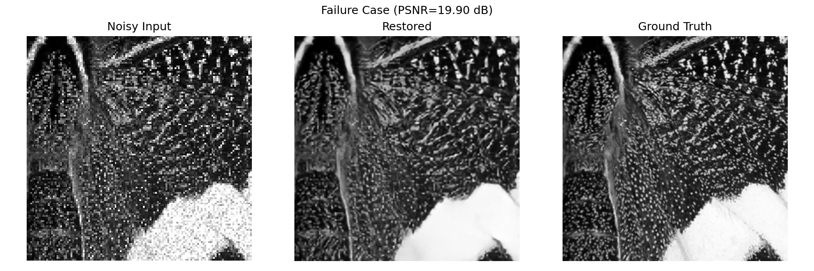
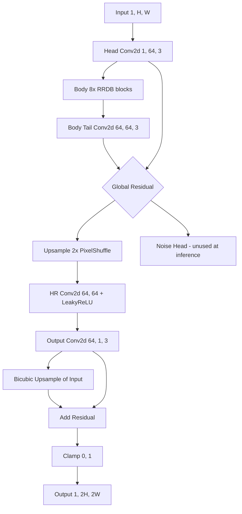
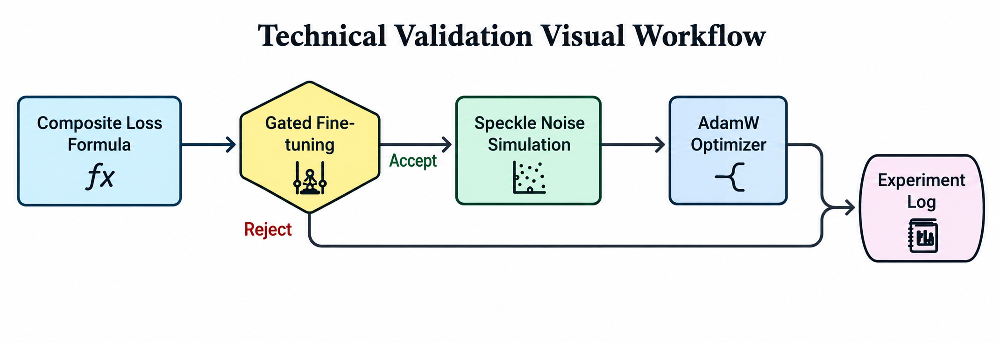

# AI-Based Restoration of Degraded Images : Forsaken Apex

RRDB-based single-image restoration network (5.997M parameters) that upscales and denoises degraded grayscale inputs by 2x.

## Results

### Performance

| Metric | Value |
|--------|-------|
| PSNR (dB) | 28.47 |
| SSIM | 0.767 |
| LPIPS | 0.164 |
| Sharpness | 50.5% of GT |

Evaluated on 320 full-resolution validation images.

### Inference Throughput

| Batch Size | ms/image | images/sec |
|------------|----------|------------|
| 1 | 9.80 | 102.0 |
| 4 | 5.74 | 174.3 |

### Benchmark Comparison

RestorationNet vs. bicubic and standard AI baseline across PSNR, SSIM, and throughput:





### PSNR Comparison

Higher PSNR indicates better image reconstruction quality:



### Result Examples

**Success Case** : clean texture recovery, minimal artifacts:



**Failure Case** : some over-smoothing in high-frequency detail regions:



## Architecture

### Enhancement Process

The model restores degraded images through a multi-stage pipeline:


### Model Architecture



| Parameter | Value |
|-----------|-------|
| Parameters | 5.997M |
| Input | 1-ch grayscale, arbitrary size |
| Output | 1-ch grayscale, 2x resolution |
| RRDB blocks | 8 |
| DenseBlock growth | gc=32, base nf=64 |
| Upsample | PixelShuffle 2x |
| Output | Global residual on bicubic interpolation |

## Training

### Technical Validation Workflow

Our training pipeline uses a gated fine-tuning approach with accept/reject gates:



### Base Training (100 epochs)

- **Loss:** Composite : Charbonnier (w=1.0) + Gradient (w=0.1) + Physics Consistency (w=0.1) + SSIM (w=0.2) + LPIPS (w=0.05) + Blind Spot (w=0.05)
- **Optimizer:** AdamW (lr=2e-4, betas=(0.9, 0.99), weight_decay=1e-4)
- **Scheduler:** CosineAnnealingLR (T_max=100)
- **Batch size:** 16 effective (4 x 4 gradient accumulation)
- **Mixed precision:** AMP with GradScaler, gradient clipping (max_norm=5.0)
- **Data:** 50% real pairs + 50% synthetic degradation (speckle noise, Gaussian readout)
- **Seeds:** torch/random = 42

### Refinement Pipeline

| Stage | Epochs | Change | PSNR | Decision |
|-------|--------|--------|------|----------|
| Base | 100 | : | 28.58 dB | Baseline |
| Exp 1 | 15 | clip=False in degradation | 28.60 dB | Accepted |
| Exp 2 | 7 | w_grad=0.4, w_lpips=0.25 | ~26.7 dB | Rejected |
| Exp 2b (final) | 9 | w_grad=0.2, w_lpips=0.12 | 28.47 dB | Accepted |

**Final checkpoint:** `best_refined.pt` (epoch 9 of Exp 2b)

Exp 2b traded -0.13 dB PSNR for +2.87 points of sharpness (~22x the noise floor), with improved LPIPS (0.181 to 0.164).

## Setup

```bash
pip install -r requirements.txt
```

Place the trained checkpoint at:

```
models/restoration_best.pt
```

## Usage

```bash
python run.py <input-dir> <output-dir>
```

- `<input-dir>` : directory containing `.npy` degraded images (grayscale, float `[0,1]` or uint8 `[0,255]`)
- `<output-dir>` : directory where restored `.npy` files are written

Output images are saved as float32 `.npy` files with values in `[0, 1]`, shape `(H, W)` where `H = 2 * input_h` and `W = 2 * input_w`.

## Environment

- Python >= 3.10
- CUDA-capable GPU (NVIDIA, tested with CUDA 12.x)
- No internet access required at inference time
